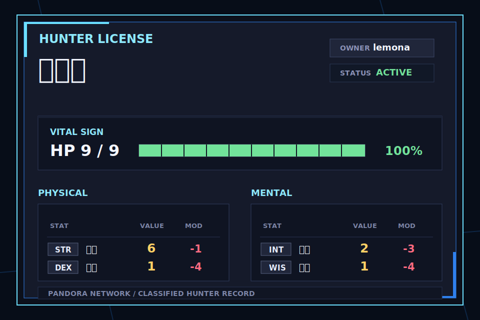

# PROJECT:PANDORA

Discord 기반 TRPG 운영 자동화 봇입니다.  
캐릭터 등록, 선택, 조회, 상태창 이미지 출력, 관리자용 캐릭터 대시보드를 통해 어반 판타지 커뮤니티 운영 흐름을 자동화하는 것을 목표로 합니다.

## Preview



## 프로젝트 구성

```text
PandoraBot/
├─ PandoraBot/       Discord 봇
├─ PandoraAdmin/     관리자용 로컬 웹 대시보드
└─ PandoraBot.slnx   솔루션 파일
```

## 주요 기능

### Discord Bot

• `/등록`: Google Sheets 캐릭터 원본 시트에서 캐릭터 정보를 저장소에 등록  
• `/선택`: 본인 소유 캐릭터 중 현재 사용할 캐릭터 선택 또는 변경  
• `/현재`: 현재 선택된 캐릭터와 주요 상태 확인  
• `/해제`: 현재 선택된 캐릭터 선택 상태 해제  
• `/헤제`: `/해제` 오타 대비 별칭  
• `/삭제`: 본인 소유 캐릭터 삭제, `확인:true` 필요  
• `/목록`: 본인 등록 캐릭터 목록 확인  
• `/정보`: 선택 캐릭터의 상태창 이미지 출력

### Admin Dashboard

• 등록 캐릭터 수, 등록 유저 수, 선택 캐릭터 수, 중복 의심 행 요약  
• 캐릭터명 또는 Discord User ID 검색  
• HP, Physical, Mental 능력치 확인  
• 선택 상태 변경 / 해제 / 삭제  
• 동일 User ID + 캐릭터 이름 기준 중복 데이터 정리

## 기술 스택

• C# / .NET  
• Discord.Net  
• Google Sheets API  
• ImageSharp / ImageSharp.Drawing  
• ASP.NET Core Minimal API

## 설정 파일

이 저장소에는 실제 토큰과 Google 서비스 계정 키를 올리면 안 됩니다.

공개 저장소에는 아래 예시 파일만 포함합니다.

```text
PandoraBot/BotSettings.example.json
PandoraBot/Credental.example.json
```

실행할 때는 예시 파일을 복사해 실제 파일을 만든 뒤 값을 채웁니다.

```powershell
copy PandoraBot\BotSettings.example.json PandoraBot\BotSettings.json
copy PandoraBot\Credental.example.json PandoraBot\Credental.json
```

`BotSettings.json` 예시:

```json
{
  "DiscordToken": "PUT_YOUR_DISCORD_BOT_TOKEN_HERE",
  "GuildId": 123456789012345678,
  "GoogleCredentialPath": "Credental.json"
}
```

## 실행 방법

### Discord Bot

```powershell
cd PandoraBot
dotnet run
```

### Admin Dashboard

```powershell
cd PandoraAdmin
dotnet run --urls http://localhost:5088
```

브라우저에서 접속:

```text
http://localhost:5088
```

## 보안 주의

다음 파일은 절대 GitHub에 올리지 않습니다.

```text
PandoraBot/BotSettings.json
PandoraBot/Credental.json
```

Discord Bot Token이 외부에 노출된 적이 있다면 Discord Developer Portal에서 즉시 토큰을 재발급해야 합니다.

## 개발 현황

현재 캐릭터 관리 기반 기능이 구현되어 있으며, 다음 단계는 `/판정` 명령어와 판정 로그 시스템입니다.

## License

This project is licensed under the MIT License. See [LICENSE](LICENSE) for details.
